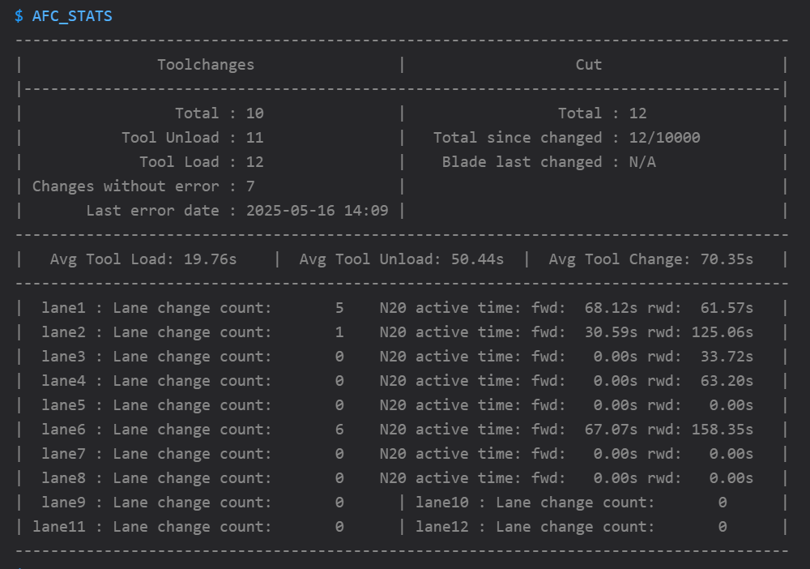
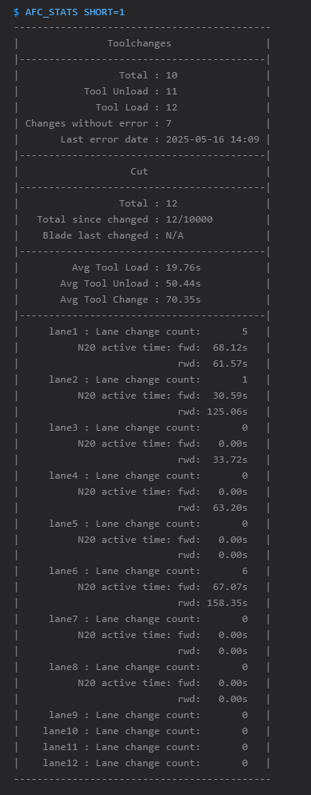
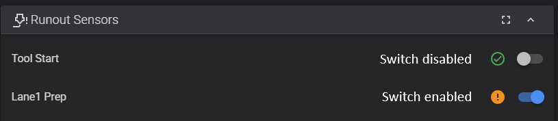

# Overview of features

This section goes over the features that can be found in Armored Turtle Automated Filament Control (AFC) Software.

## TurtleNeck Buffer Ram Sensor

AFC allows the use of using the TurtleNeck Buffers as a ram sensor for detecting when filament is loaded to the toolhead
extruder. This can be used inplace of a toolhead filament sensor. To learn more about this feature please
see [Buffer Ram Sensor](installation/buffer-ram-sensor.md) document.

## Bypass

By default, if a hardware sensor is not setup for a bypass AFC will create a virtual bypass filament sensor. 
Enabling the virtual filament sensor disables AFC functionality and enabled state persists across reboots.

You can also enable AFC bypass with a hardware sensor by printing out a [bypass](https://github.com/ArmoredTurtle/AFC-Accessories/tree/main/AFC_Bypass) 
accessory, connecting inline it after your buffer and adding a bypass filament sensor to klipper config like below. 
Once filament is inserted into the bypass side, the switch disables AFC functionality so you can print like normal.

```
[filament_switch_sensor bypass]
switch_pin: <replace with MCU pin that switch is connected to>
pause_on_runout: False
```

When either bypass is enabled/filament detect all AFC functionality with loading to the toolhead is disabled. Calling
the `TOOL_UNLOAD` macro will call the `UNLOAD_FILAMENT` macro if it exists so that filament can still be manually unload
from the toolhead.

## Lower stepper current when printing

For longer prints you may want to have the ability to lower BoxTurtles steppers current as they can get hot when engaged
for a long period of time.

Enabling lower current during printing can be enabled two ways:

1. Set `global_print_current` in AFC.cfg file
2. Set `print_current` for each AFC_stepper, this will override `global_print_current` in AFC.cfg

During testing, it was found that 0.6A worked well during printing and kept the steppers warms to the touch. We 
would not suggest going lower than this or the TurtleNeck buffers may not work as intended when using BOM spec steppers.

## Enabling switches to show up in Mainsail/Fluidd GUIs

AFC has the ability to add sensors as filament switches so they show up in Mainsail/Fluidd web gui. This can either be
enabled globally by adding/uncommenting `enable_sensors_in_gui: True` in AFC.cfg file or enabled/disabled in individual
sections in your config file. Enabling this globally is useful for debugging purposes, but setting in individual
sections will override the global setting.

AFC_buffer, AFC_extruder, AFC_hub, and AFC_stepper sections in your AFC_hardware.cfg or AFC_Turtle(n).cfg have the
ability to enable sensor by adding `enable_sensors_in_gui: True`. There is an extra config value for AFC_stepper to
allow you to either show both sensors or just prep/load sensors by using `sensor_to_show: prep` or
`sensor_to_show: load`, leaving out sensor_to_show will show both sensors.

## Tool change count

AFC has the ability to keep track of number of tool changes when doing multicolor prints. Number of toolchanges
will be pulled from files metadata stored in moonraker. AFC will keep track of tool changes and print out the 
current tool change number when a T(n) command is called from gcode. 


!!!note "Minimum Moonraker Version Required"

    Make sure moonraker version is at least v0.9.3-64 to utilize this feature.  

If you have set up your `Change filament G-code` section to use `SET_AFC_TOOLCHANGES` in your slicer please remove
the following lines:

```cfg
{ if toolchange_count == 1 }SET_AFC_TOOLCHANGES TOOLCHANGES=[total_toolchanges]{endif }
```

Also remove the following if added to your `PRINT_END` section as number of toolchanges will now automatically reset back
once print is done/canceled.

`SET_AFC_TOOLCHANGES TOOLCHANGES=0`

## Setting extruder temp

AFC has the ability to automatically set extruder temperature based off filament material type loaded or spoolman
extruder temperature if its set.

If not using spoolman make sure the material is set for your lanes and the temperature values will be pulled from
`default_material_temps` variable in `AFC.cfg` file. This list can also be updated/added to, just make sure new entries
have a comma inbetween and follow current format when adding new variable.

If spoolman extruder temperature or material type is not defined AFC default's to `min_extrude_temp` variable defined in
`[extruder]` section in `printer.cfg`

```cfg
default_material_temps: PLA:210, ABS:235, ASA:235 # Default temperature to set extruder when loading/unloading lanes.
```

## Loading filament to hub

For users that have a hub not located in their Box Turtle, AFC has the ability to load filament to their hub once its
inserted. This is turned on by default and this will happen even if your hub is located in your Box Turtle. This can be
disabled by setting `load_to_hub: False` in your `AFC.cfg` file. Also individual lanes can be turn on/off by setting
`load_to_hub: True/False` under `[AFC_stepper <lane_name>]` section in your config.

## Variable purge length on filament change

AFC has the ability to purge different lengths with orcas flush volumes when doing filament changes with T(n) macros. To
use this feature update your Change Filament G-Code section in your orca slicer to the following:

`T[next_extruder] PURGE_LENGTH=[flush_length]`

Could also be added to your PRINT_START macro with a specific length, this would be ideal for if your first filament is
not currently loaded as the PURGE_LENGTH from Orca for the first change would be zero

`T{initial_tool} PURGE_LENGTH=100`

!!!warning "Important Note"

    If your first filament is not currently loaded and needs to change, `PURGE_LENGTH` will be zero and the poop
    macro will then use `variable_purge_length` from AFC_Macro_Vars.cfg file, so make sure this is set correctly for
    your printer

## Spoolman

AFC has the ability to integrate with Spoolman. This is as simple as ensuring that the following information is 
present in your `moonraker.conf` file:

```ini
[spoolman]
server: http://<ip>:<port>
sync_rate: 5
```

For example:

```ini
[spoolman]
server: http://192.168.1.184:7912
sync_rate: 5
```

### Spoolman QR Scanner Support

Support for QR scanners is provided through [SET_NEXT_SPOOL_ID](klipper/internal/spool.md#AFC_spool.AFCSpool.cmd_SET_NEXT_SPOOL_ID). 

A USB QR code scanner implementation [afc-spool-scan](https://github.com/kekiefer/afc-spool-scan) is available to install on the klipper host.

## Direct Drive

AFC has the ability to use direct loading straight to the extruder/toolhead. There should be no hub in-between that 
lane and the extruder when this option is used. Using `direct` will disable the ability to use the automatic 
calibration functions.

To enable `direct` mode, the following line needs to be added to the `[AFC_stepper <lane_name>]` section in your 
configuration:

``` cfg
hub: direct
```

## Espooler Print Assist

AFC has the ability to activate espooler forward movement when printing to help aid in spools from
walking around and riding up wheels when they get low. This feature is enabled by default once your filament weight 
gets below 500 grams.  

The goal of this is to enable the spooler for a small amount of time so that filament on the spool is loosened up some,
then by the time your printer extrudes `mm_movement` amount(defaults to 150) the filament on your spool should just be 
getting taught before print assist activates again.  

This feature can be turned off by adding `enable_assist: False` to your `[AFC_BoxTurtle Turtle_(n)]` or `[AFC]` or per `[AFC_Stepper]` config sections.
If you would like to change the weight value where print assist is activated, then add `enable_assist_weight: <new_number>` 
to your configuration, this value can be added to the same sections as `enable_assist` variable. 

The following variables described in [AFC_lane](configuration/AFC_UnitType_1.cfg.md#afc_lane-lane_name-section) section are all
the values that go into the print assist logic: `enable_assist`, `enable_assist_weight`, `timer_delay`, `delta_movement`, `mm_movement`,
`cycles_per_rotation`, `pwm_value`, `spoolrate`. The values can be configured per lane (`AFC_Stepper`) or per Unit (`AFC_BoxTurtle`).

With this functionality the following macros allow you to enable/disable and tweak the settings for
print assist. 

- [SET_ESPOOLER_VALUES](klipper/internal/lane.md#AFC_assist.Espooler.cmd_SET_ESPOOLER_VALUES)  
- [ENABLE_ESPOOLER_ASSIST](klipper/internal/lane.md#AFC_assist.Espooler.cmd_ENABLE_ESPOOLER_ASSIST)  
- [DISABLE_ESPOOLER_ASSIST](klipper/internal/lane.md#AFC_assist.Espooler.cmd_DISABLE_ESPOOLER_ASSIST)  
- [TEST_ESPOOLER_ASSIST](klipper/internal/lane.md#AFC_assist.Espooler.cmd_DISABLE_ESPOOLER_ASSIST)    

If the default values for print assist is unspooling too much you can start off by changing either `spoolrate` or 
`cycles_per_rotation` to decrease the time that the N20 motors are active( aka cruise_time ). Spoolrate scales all 
variables by that amount and cycles_per_rotation controls how long in milliseconds it takes to spin the spool a full rotation.  

Below is a chart with calculations that shows what `cruise_time` will end up being if either `spoolrate` or `cycles_per_rotation` is changed  
<table class="espooler" style="font-size: medium">
<style>
td, th{
    padding: .1em 1em;
    border: 1px solid grey;
}
</style>
<thead>
<tr><th colspan=2>Cruise time when ONLY changing spoolrate</th><th colspan=2>Cruise time when ONLY changing cycles_per_rotation</th></tr></thead>
<tbody>
<tr><th>spoolrate</th><th>cruise_time</th><th>cycles_per_rotation</th><th>cruise_time</th></tr>
<tr><td>1  </td><td>0.4593</td><td>1275</td><td>0.4593</td></tr>
<tr><td>0.9</td><td>0.4134</td><td>1100</td><td>0.3963</td></tr>
<tr><td>0.8</td><td>0.3307</td><td>1000</td><td>0.3603</td></tr>
<tr><td>0.7</td><td>0.2315</td><td>900 </td><td>0.3242</td></tr>
<tr><td>0.6</td><td>0.1389</td><td>800 </td><td>0.2882</td></tr>
<tr><td>0.5</td><td>0.0694</td><td>700 </td><td>0.2522</td></tr>
<tr><td>0.4</td><td>0.0277</td><td>600 </td><td>0.2161</td></tr>
<tr><td>0.3</td><td>0.0083</td><td>500 </td><td>0.1801</td></tr>
<tr><td>0.2</td><td>0.0016</td><td>400 </td><td>0.1441</td></tr>
<tr><td>0.1</td><td>0.0001</td><td>300 </td><td>0.1080</td></tr>
</tbody>
</table>

Formula to calculate `cruise_time`:
```
rotation = mm movement / spool circumference
correction_factor = 1.0 +  ( 1.68 * -rotations^5)
cruise_time = rotations * cycles_per_rotation * correction_factor
```
Note: Spool circumference is automatically calculated from `spool_outer_diameter` variable

## Quiet Mode

AFC has the ability to run motors at slower speed when doing loads to reduce motor noise. This is helpful for
those that may have a printer in their bedroom and would like to run multicolor prints overnight. To enabled
quiet mode there is a filament switch under your filament sensor called `Quiet Mode`, once this is enabled AFC will do long moves at
a slower speed(default: 50mm/s). Quiet mode speed does not apply to PTFE calibrations and lane resets.  

Speed for quiet mode can be updated by setting `quiet_moves_speed` variable in either `[AFC]` section, or 
`[AFC_stepper <name>]` [section](configuration/AFC_UnitType_1.cfg.md#afc_stepper-lane_name-section) (adding here override setting in `[AFC]` [section](configuration/AFC.cfg.md#afc-section)).

## Tracking Toolchange Statistics

AFC tracks all toolchanges, lane loading/unloading, number of changes since last load error, total number
of cuts performed, number of cuts since blade last changed and how long N20 motors have been active if
N20 are configured in your setup.  

AFC will also start warning in console when your number of blade cuts is 1k less than the tool cut threshold letting you 
know that it's getting close to change blade. Once number of cuts exceed threshold AFC starts printing out error messages 
in the console. If blade is changed use `AFC_CHANGE_BLADE` macro to reset count and date blade was changed.  

Use the following macros to print out statistics in console, update when blade has been changes and reset
N20 active time:  
- [AFC_STATS](klipper/internal/misc.md#AFC.afc.cmd_AFC_STATS) - prints statistics to console  
- [AFC_CHANGE_BLADE](klipper/internal/misc.md#AFC.afc.cmd_AFC_CHANGE_BLADE) - run macro when blade is changed, sets date that blade was changes and resets `Total since changed` count  
- [AFC_RESET_MOTOR_TIME](klipper/internal/lane.md#AFC_assist.Espooler.cmd_AFC_RESET_MOTOR_TIME) - run macro when N20 motor has been swapped out in a lane

Both variables can be added/updated in `[AFC]` [section](configuration/AFC.cfg.md#afc-section) :  
- `print_short_stats`: Add/uncomment to have the statistics printout to be skinner. Useful for those that have consoles that are skinner( eg. Klipperscreen )  
- `tool_cut_threshold`: Defaults to 10000 cuts, update to if you want threshold to be larger. This controls when AFC prints out warning/errors when number of cuts since changed reaches/exceeds this number.

Examples of what statistics printout looks like:  



## Button controls

!!!note "Original Design"

    The original design of this feature was created by @Trev1Ak and is available [here](https://discord.com/channels/1229586267671629945/1327060485408952340).

    This feature is now built into the AFC-Klipper-Add-On and can be enabled by following the instructions below.

    Do **NOT** use the provided Klipper config file from the original design, as it is not compatible with the AFC-Klipper-Add-On.

An optional feature that can be supported is the use of physical buttons to control various functionality of the AFC system.

If enabled, and configured properly, the following functionality can be controlled via buttons:

Press <1.2 (short-press) seconds commands as follows:

- If no lane is loaded to tool head it will load commanded lane.
- If lane loaded to tool head is other than commanded lane it will unload other lane and load commanded lane.
- If commanded; lane is loaded to tool head it will automatically unload lane

Press >1.2 (long-press) seconds commands as follows:

- If lane is loaded to tool head it will unload lane and eject spool
- If another lane is loaded to tool head it will only eject commanded lane and not interrupt other lanes.

BOM: 

- 4ea Omron B3F-1026 switches/Optional verified off brand switches Amazon https://a.co/d/hmtJkk8
- 4ea JST 3 pin male connectors for AFC Lite board
- 3 Meters of 24awg or 28awg wire (your choice)

## Detecting runouts
AFC has the ability to detect runouts or filament breakage while printing. If filament is not detected at the toolhead or hub sensors while printing then a pause command is issued with an error message stating what happened so the error can be fixed before resuming the print.  

During printing if the PREP sensor goes low, one of two things can happen.  

- If infinite spool is not set for the lane that the PREP sensor went low on, AFC will issue a pause command so issue can be fixed before resuming print. Note: If `unload_on_runout: True` is set in AFC config section, lane will be unloaded from toolhead after pausing.
- If infinite spool is set with [SET_MAP](klipper/internal/spool.md#AFC_spool.AFCSpool.cmd_SET_MAP) macro, then AFC will unload filament from runout lane and then load lane as specified when running SET_MAP macro. If tool loading was successful print will continue. If tool load was unsuccessful AFC will issue pause command and an error will be displayed.  

A debounce delay can also be added so that the sensor(s) need to be low for a period of time before triggering the runout logic. By default this is set to zero but can be changed by adding `debounce_delay: <delay_value>` to your AFC config which is a global value. Debounce delay can also be added in AFC_extruder, AFC_hub, AFC_stepper, and AFC_lane configs which override the global AFC setting. See configuration sections for each config for more information.

Runout detection can be turned off while printing by disabling sensor in web gui. If PREP sensor is disabled this also disables infinite spool. The state of the switches is not persistent and will reset to enabled when klipper is restarted.

Example of runout enabled/disabled:
