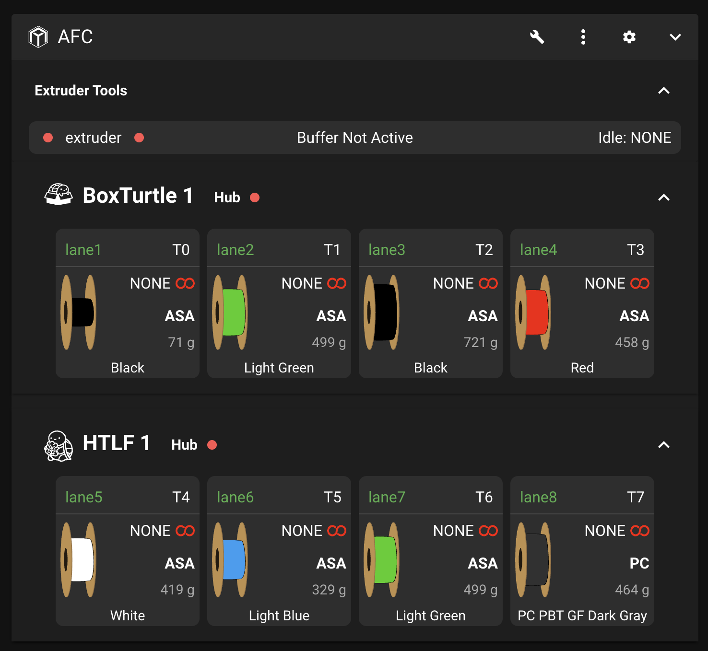
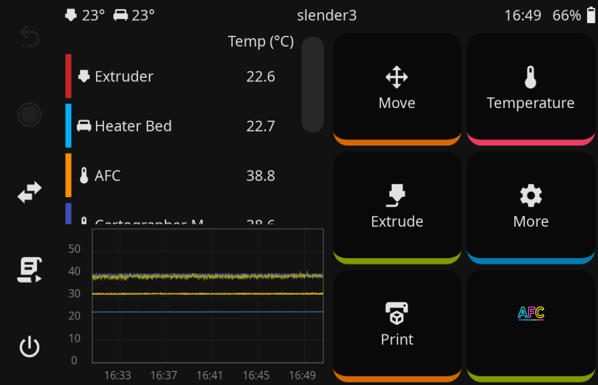
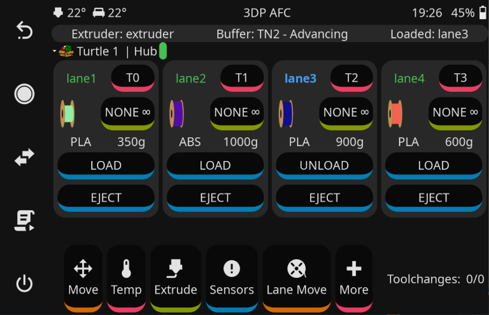

# GUI support

## Mainsail
AFC integrates with [mainsail](https://www.mainsail.xyz), currently via [an open-source fork](https://github.com/ArmoredTurtle/mainsail-AFC/). As shown below, it can integrate with multiple 
units including different types (in this case, BoxTurtle and [HTLF](https://www.printables.com/model/1249234-happyturtlelettucefeeder-htlf-by-armoredturtle-an)).

Once installed, you may need to force reload your browser with ++ctrl+f5++ (Chrome) or a similar command in your browser
to ensure that the new features are displayed correctly. See [here](../troubleshooting/troubleshooting.md#afc-sections-not-showing-up-correctly) 
for more information on browser cache issues.

## KlipperScreen
A KlipperScreen integration is available, which allows you to control AFC features directly from the KlipperScreen interface. 
This includes loading and unloading filament, as well as monitoring the status of the AFC system.

For more information, please refer to the [AFC KlipperScreen GitHub repository](https://github.com/ArmoredTurtle/AFC-Klipper-Screen-Add-On)

## Fluidd
Integration with Fluidd is under development, but not yet in a released state.
