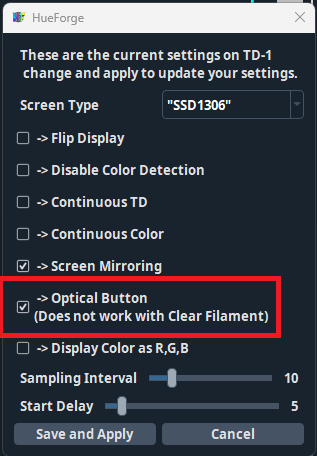

## Overview 
AFC has the ability to grab data from multiple TD-1 devices that are connected to your printer. TD-1 devices can be connected inline with your PTFE tubes to capture data from all lanes, or multiple TD-1's can be added to capture data from specific units. AFC can also be setup to capture TD-1 data once filament is inserted into a lane and/or during startup PREP routine. Once this data is captured it will be sent to moonraker database to allow third-parties (like orca once support is added) to read what color, TD, mapping, material filament, etc. is in each lane, learn more about this feature [here](features.md#exposing-lane-data-for-third-parties)

## Prerequisite
- TD-1 firmware version on at least version 2.0.0, updating requires Hueforge v0.9.1.2 or newer.
- After updating, run through lux and RBG calibration in Hueforge under TD-1 dropdown.
- For TD-1 users, with version 2.0.0 firmware your ball bearing can be removed to reduce filament friction, but make sure to check `Optical Button` in Hueforge under TD-1 -> TD-1 Settings.

## PTFE Case
- TD-1 PTFE case so that PTFE tubes can be connected to either side : [makerworld link](https://makerworld.com/en/models/1414761-td-1-ptfe-case#profileId-1469128)

## Moonraker Setup
To communicate correctly with TD-1 devices, moonraker needs to be updated to at least **v0.9.3-116-gb11a7915** and the following need's to be added to moonraker.conf file
```
[td1]
```
Once added, restart printer. Once restarted and TD-1 device is connected you will see `Found TD-1 device connected to printer` print out in your console if everything is working correctly.

## Calibration
To calibrate bowden length to TD-1 device run `AFC_CALIBRATION` and on calibration section select `Calibrate TD-1 Length` then choose when lane to use for calibration. This calibration only needs to be done with one lane per device. Once calibration starts it will be slow as it takes time for TD-1 to update once filament is detected. Once calibration is done `afc_unload_bowden_length` variable will automatically be updated, if its not already in your config file it will be added to `AFC_auto_vars.cfg` file.

## Other configuration values
- To capture TD and color values when filament is loaded into a lane `capture_td1_when_loaded` needs to be set to `True`. This variable can be added to AFC, AFC_BoxTurtle/AFC_NightOwl/etc, AFC_Stepper/AFC_lane config sections. This only happens if a lane is not loaded to the toolhead and the hub is clear.
- To capture TD and color during PREP startup sequence set `capture_td1_data: True` under AFC_prep in AFC.cfg file. This only happens if a lane is not loaded to the toolhead and the hub is clear. If any error occurs during PREP AFC will not capture data upon first loading.
- When using multiple TD-1 devices in system, use `td1_device_id` to specify which id belongs to a specific Unit or lane. This value can be added to AFC_BoxTurtle/AFC_NightOwl/etc, AFC_Stepper/AFC_lane config sections. If only using one device, this variable is not needed.

## Macros
- To manually grab TD and color for a lane use [AFC_GET_TD_ONE_DATA](klipper/internal/td1.md#AFC_functions.afcFunction.cmd_AFC_GET_TD_ONE_DATA) which will create a popup to allow selection of which lane to grab the data from.
- If filament is loaded to the toolhead when printer is restarted/first turned on, TD-1 will be in a error state. To fix this unload filament from toolhead with [TOOL_UNLOAD](klipper/internal/lane.md#AFC.afc.cmd_TOOL_UNLOAD) and then run [AFC_RESET_TD1](klipper/internal/td1.md#AFC_functions.afcFunction.cmd_AFC_RESET_TD1) with correct id to reset TD-1. AFC will wait up to 30 seconds for reset to happen and will display message if reset was successful or unsuccessful.

## Troubleshooting
- If you think that your TD-1 is connected but AFC still cannot see your device, navigate to `http://<printter_ip>/machine/td1/data` to verify that you TD-1 device shows up here or not.

Example of moonraker detecting TD-1:
```
{
  "result": {
    "status": "ok",
    "devices": {
      "E6625877D318C430": {
        "td": null,
        "color": null,
        "scan_time": null
      }
    }
  }
}
```

If TD-1 does not show up in query, SSH into printer and list USB serial devices with:
```
ls /dev/serial/by-id/*
```

If TD-1 is detected you should see something like the following print out.
```
/dev/serial/by-id/usb-AJAX_3D_TD-1_E6625877D318C430-if00
```